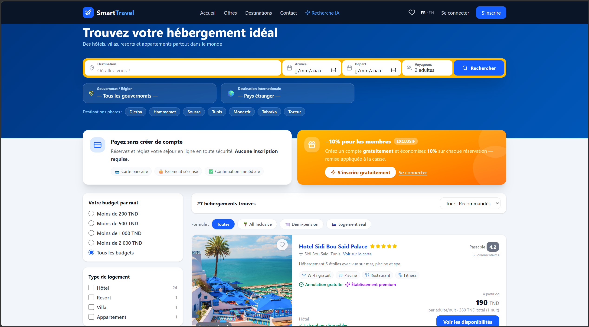
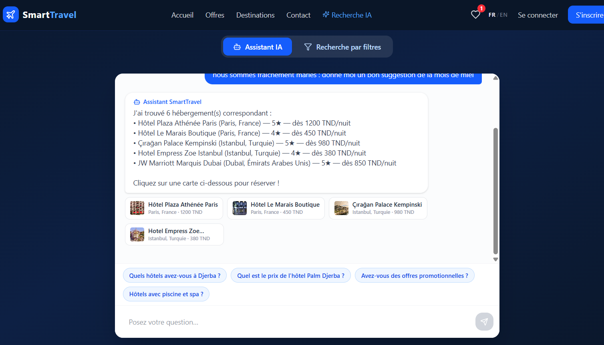
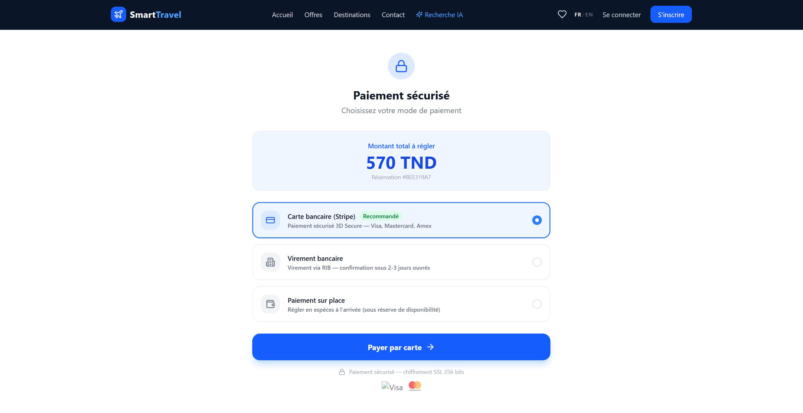
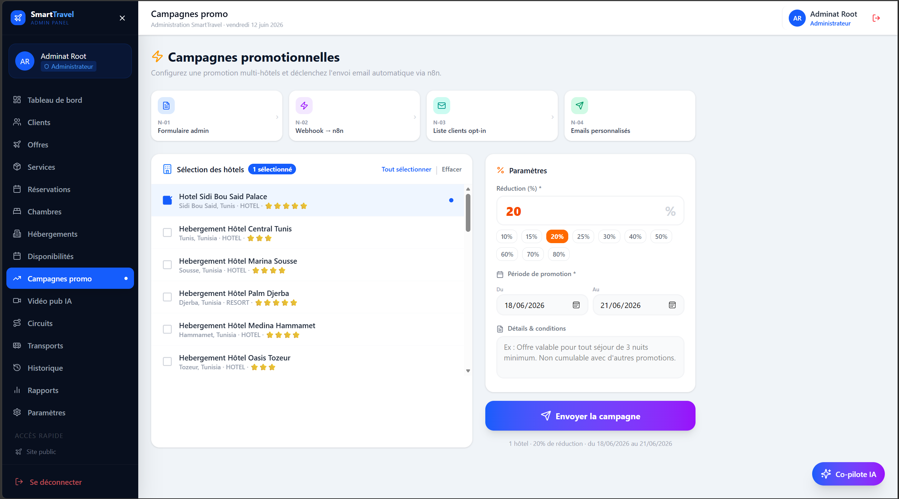
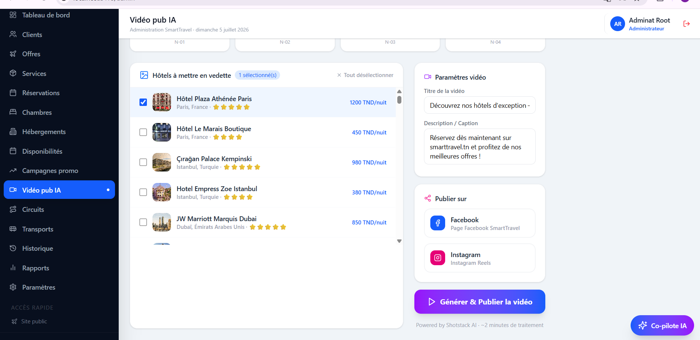
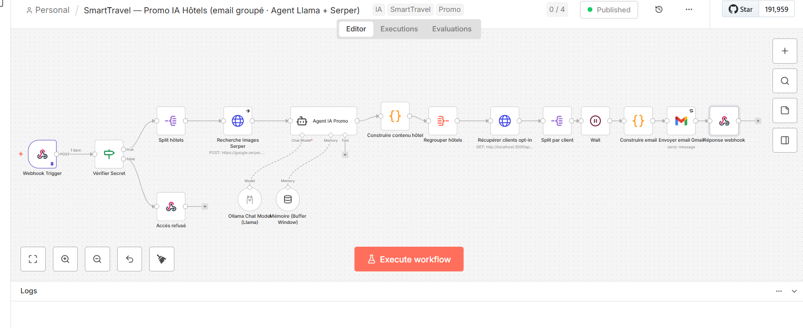
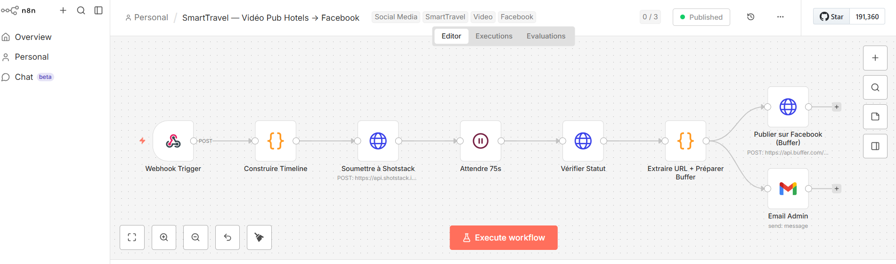
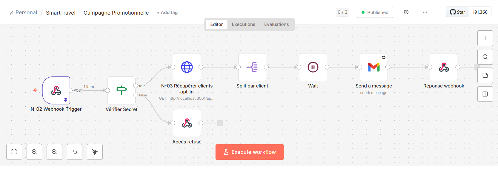
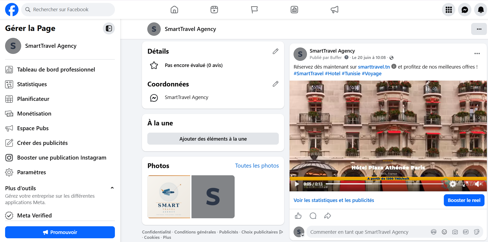
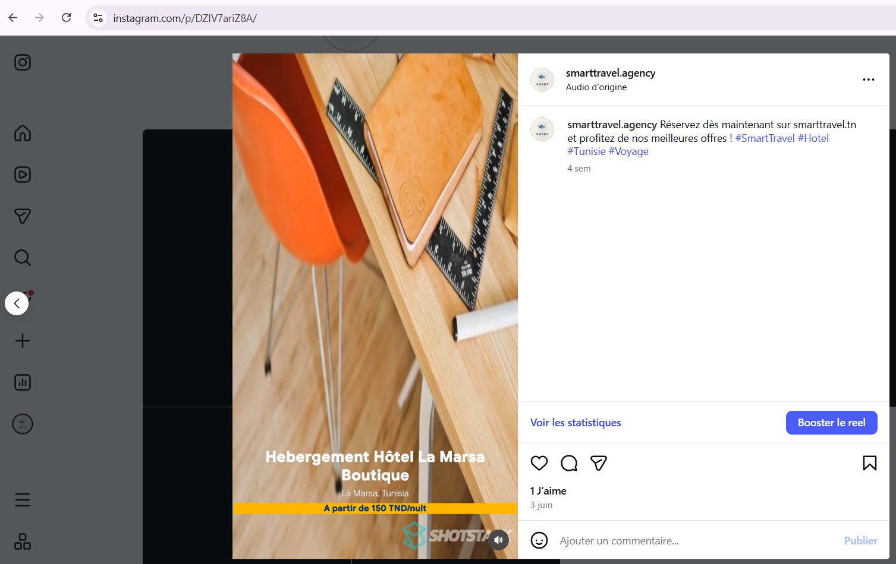

<div align="center">

# ✈️ SmartTravel — Plateforme de Gestion d'Agence de Voyage

### Application web full-stack **MERN** enrichie par l'**Intelligence Artificielle** et l'**automatisation no-code**

*Projet de Fin d'Études (PFE)*


</div>

---

## 🎯 Présentation

**SmartTravel** est une plateforme complète de gestion d'agence de voyage qui digitalise l'ensemble
du parcours client — de la découverte des offres à la réservation, au paiement en ligne et à la
facturation — tout en offrant aux administrateurs un back-office puissant.

Le projet se distingue par l'intégration de **briques d'Intelligence Artificielle** (assistant
conversationnel, agents autonomes de réservation et d'optimisation, serveur MCP) et de
**workflows d'automatisation n8n** (campagnes promotionnelles générées par IA, publicités vidéo,
notifications email).

---

## ✨ Fonctionnalités clés

### 👤 Espace Client / Visiteur
- 🔍 **Catalogue d'offres** : hébergements, chambres, circuits, transports et services, avec recherche par mots-clés et filtrage par destination
- 🧳 **Réservation intelligente** : gestion adultes / enfants, contrôle de capacité et de disponibilité en temps réel
- 💳 **Paiement en ligne sécurisé** via **Stripe**, génération automatique de **factures PDF**
- 🤖 **Assistant IA conversationnel** : répond aux questions à partir des données réelles (offres par destination), fonctionne en mode *retrieval* hors-ligne et s'enrichit d'un LLM (OpenAI / Ollama) si disponible
- ⭐ **Avis & préférences** clients
- 🗺️ **Cartes interactives** (Leaflet) et **calendrier** de disponibilités (FullCalendar)

### 🛠️ Back-office Administrateur
- 📊 **Tableaux de bord** et statistiques (Recharts)
- 🏨 **Gestion complète** : offres, hébergements, chambres, circuits, transports, services, utilisateurs
- 📅 **Gestion des réservations** avec détection de conflits et blocages de créneaux
- 🧠 **Agents IA autonomes** : agent de réservation, agent de résolution de conflits, agent d'optimisation
- 🖼️ **Gestion des médias** : upload (Multer), proxy et enrichissement automatique d'images

### 🤖 Intelligence Artificielle & Automatisation
- 🔌 **Serveur MCP** (Model Context Protocol) permettant de piloter la plateforme depuis **Claude Desktop**
- 📣 **Campagnes promotionnelles générées par IA** (workflows n8n)
- 🎬 **Publicités vidéo automatisées** pour les hébergements
- 📧 **Notifications email** transactionnelles via **Brevo** / Nodemailer

---

## 📸 Démo & Captures d'écran

### 🏠 Site public — Recherche d'hébergement
Page d'accueil avec moteur de recherche (destination, dates, voyageurs), filtres avancés (budget,
type de logement, formule) et résultats en temps réel. Réservation possible **sans créer de compte**.



### 🤖 Assistant IA conversationnel
Un chatbot intelligent qui comprend les demandes en langage naturel (ex. *« nous sommes fraîchement
mariés, donne-moi une bonne suggestion pour la lune de miel »*) et répond avec de vraies offres
issues de la base de données, sous forme de **cartes cliquables** menant directement à la réservation.



### 💳 Paiement sécurisé
Tunnel de paiement multi-options : **carte bancaire via Stripe** (3D Secure — Visa, Mastercard, Amex),
virement bancaire ou paiement sur place, avec récapitulatif du montant et de la référence de réservation.



### 🛠️ Back-office administrateur

**Campagnes promotionnelles** — L'administrateur sélectionne les hôtels, définit une réduction (%)
et une période de validité, puis déclenche l'envoi automatique d'emails promotionnels via n8n.



**Studio « Vidéo Pub IA »** — Sélection des hôtels à mettre en vedette, personnalisation du titre et
de la description, puis **génération d'une publicité vidéo par IA** (Shotstack) et **publication
automatique sur Facebook et Instagram** en un clic.



### ⚙️ Workflows d'automatisation n8n

**1. Campagne promo IA par email** — Un agent IA local (**Llama via Ollama**) rédige le contenu
promotionnel, enrichi d'images (**Serper**), puis envoie un email groupé et personnalisé à chaque
client opt-in via Gmail. Sécurisé par vérification de secret sur le webhook.



**2. Génération & publication de vidéo pub → Facebook / Instagram** — Construction d'une timeline,
soumission à **Shotstack** pour le rendu vidéo, attente du rendu, puis publication automatique sur
les réseaux sociaux via **Buffer** et notification à l'administrateur.



**3. Campagne promotionnelle (email opt-in)** — Réception du déclencheur (webhook sécurisé),
récupération des clients ayant consenti, personnalisation par client puis envoi de l'email via Gmail
et réponse au webhook.



### 🌐 Résultat : publications automatiques sur les réseaux sociaux

Les vidéos générées par IA sont publiées automatiquement sur les pages **Facebook** et **Instagram**
de l'agence, avec titre, description et hashtags — sans intervention manuelle.

| Facebook | Instagram Reels |
|----------|-----------------|
|  |  |

---

## 🏗️ Architecture technique

```
smarttravel/
├── Travel Agency App/         # Frontend — React 18 + TypeScript + Vite
│   └── src/app/
│       ├── pages/             # public / client / admin
│       ├── components/        # UI (Radix, MUI), layout, common
│       ├── contexts/          # état global (auth, panier…)
│       └── services/          # appels API
│
├── backend/                   # API REST — Node.js + Express
│   ├── models/                # schémas Mongoose (offre, réservation, paiement…)
│   ├── routes/                # endpoints REST (auth, ai, paiement, réservation…)
│   ├── agents/                # agents IA (réservation, conflits, optimisation)
│   ├── services/              # notifications, intégrations
│   ├── middleware/            # JWT, sécurité (Helmet)
│   ├── mcp-server.js          # serveur MCP (stdio) pour Claude Desktop
│   └── mcp-http.js            # serveur MCP (HTTP)
│
└── n8n-workflows/             # workflows d'automatisation (promo IA, vidéo, email)
```

### Stack détaillée

| Couche | Technologies |
|--------|-------------|
| **Frontend** | React 18, TypeScript, Vite, TailwindCSS, Radix UI, MUI, FullCalendar, Leaflet, Recharts, jsPDF |
| **Backend** | Node.js, Express, Mongoose |
| **Base de données** | MongoDB |
| **Authentification** | JWT, bcrypt |
| **Paiement** | Stripe |
| **Sécurité** | Helmet, CORS, validation (passeport, téléphone) |
| **IA** | OpenAI / Ollama (Llama), agents autonomes, MCP SDK |
| **Automatisation** | n8n, Shotstack (vidéo), Buffer (réseaux sociaux), Serper, Brevo, Nodemailer |

---

## 🚀 Installation & démarrage

### Prérequis
- Node.js 18+
- MongoDB (local ou Atlas)

### 1. Backend
```bash
cd backend
npm install
# créer un fichier .env (voir variables ci-dessous)
npm start            # démarre l'API (nodemon)
```

### 2. Frontend
```bash
cd "Travel Agency App"
npm install
npm run dev          # démarre le serveur de développement Vite
```

### 3. Serveur MCP (optionnel — intégration Claude Desktop)
```bash
cd backend
npm run mcp          # serveur MCP en HTTP
# ou
npm run mcp:stdio    # serveur MCP en stdio
```

### Variables d'environnement (`backend/.env`)
```env
MONGO_URI=...
JWT_SECRET=...
STRIPE_SECRET_KEY=...
OPENAI_API_KEY=...        # optionnel — enrichit l'assistant IA
EMAIL_USER=...
EMAIL_PASS=...
```
> ⚠️ Les fichiers `.env` ne sont **pas** versionnés. Créez les vôtres à partir des exemples.

---

## 🧩 Principaux modèles de données

`Utilisateur` · `Offre` · `Réservation` · `Paiement` · `Facture` · `Hébergement` ·
`Chambre` · `Circuit` · `Transport` · `Service` · `Avis` · `Préférence` · `Blocage`

---

## 🛡️ Bonnes pratiques mises en œuvre

- Architecture **séparée** frontend / backend (API REST)
- **Authentification par tokens JWT** et hachage des mots de passe (bcrypt)
- **Sécurisation** des en-têtes HTTP (Helmet) et gestion fine des CORS
- **Validation** des données sensibles (numéro de passeport, téléphone)
- Code **typé** côté frontend (TypeScript)
- **Séparation des responsabilités** : models / routes / services / agents

---

## 👩‍💻 Auteur

Projet réalisé dans le cadre d'un **Projet de Fin d'Études**.

> 💼 *Développé avec passion — de la conception de l'architecture MERN à l'intégration
> d'agents IA et de pipelines d'automatisation.*

---

<div align="center">

⭐ *N'hésitez pas à laisser une étoile si ce projet vous intéresse !*

</div>
